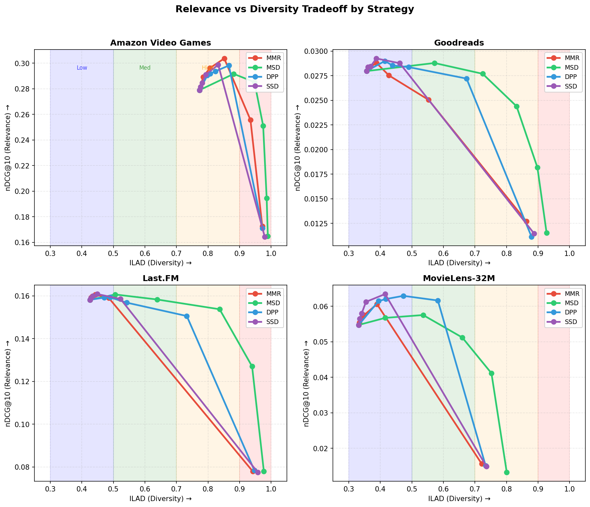

# Pyversity Benchmarks

Comprehensive evaluation of diversification strategies across 4 recommendation datasets.
We measure the relevance-diversity tradeoff to help you choose the right strategy for your use case.

## Key Finding

**Different strategies excel at different diversity levels:**

| Diversity Level | Winner | Recommendation |
|-----------------|--------|----------------|
| Low (ILAD 0.3-0.5) | **SSD** | Best for light diversification |
| Moderate (ILAD 0.5-0.7) | **MSD/DPP** | Good middle-ground |
| High (ILAD 0.7-0.9) | **MSD** | Best for heavy diversification |
| Maximum (ILAD 0.9+) | **MSD** | Dominates at extreme diversity |



## Quick Recommendations

| Your Goal | Strategy | λ | Notes |
|-----------|----------|---|-------|
| Light diversification | **SSD** | 0.6-0.8 | Highest relevance at moderate diversity |
| Balanced tradeoff | **DPP** | 0.4-0.6 | Good across multiple diversity levels |
| Maximum diversity | **MSD** | 0.4-0.6 | Best when diversity is the priority |
| Speed-critical | **MMR** | 0.6-0.8 | Fastest (O(k·n) complexity) |

## Usage

```bash
# Download datasets
python -m benchmarks download

# Run benchmarks
python -m benchmarks run

# Generate report
python -m benchmarks report
```

<details>
<summary>Detailed Results</summary>

### Datasets

| Dataset | Domain | Interactions | Source |
|---------|--------|--------------|--------|
| MovieLens-32M | Movies | 32M ratings | [GroupLens](https://grouplens.org/datasets/movielens/32m/) |
| Last.FM | Music | 92K plays | [HetRec 2011](http://ir.ii.uam.es/hetrec2011/) |
| Amazon Video Games | Games | 47K reviews | [UCSD](https://cseweb.ucsd.edu/~jmcauley/datasets.html) |
| Goodreads | Books | 869K ratings | [UCSD](https://sites.google.com/eng.ucsd.edu/ucsdbookgraph/) |

### Strategies

| Strategy | Description | Complexity |
|----------|-------------|------------|
| **MMR** | Maximal Marginal Relevance | O(k·n) |
| **MSD** | Max-Sum Diversification | O(k·n) |
| **DPP** | Determinantal Point Process | O(k²·n) |
| **SSD** | Sliding Spectrum Decomposition | O(k²·n) |

### Metrics

| Metric | Type | Description |
|--------|------|-------------|
| nDCG@10 | Relevance | Normalized Discounted Cumulative Gain |
| MRR | Relevance | Mean Reciprocal Rank |
| ILAD | Diversity | Intra-List Average Distance |
| Latency | Efficiency | Time per diversification call |

### Per-Dataset Winners

| Dataset | Low (0.3-0.5) | Moderate (0.5-0.7) | High (0.7-0.9) | Max (0.9+) |
|---------|:-------------:|:------------------:|:--------------:|:----------:|
| MovieLens-32M | SSD | DPP | MSD | - |
| Last.FM | SSD | MSD | MSD | MSD |
| Amazon-VG | - | - | MMR | MSD |
| Goodreads | SSD | MSD | MSD | MSD |

### Methodology

- **Evaluation**: Leave-one-out protocol with 2,000 sampled users per dataset
- **Embeddings**: 64-dim SVD on item co-occurrence matrix
- **Candidates**: Top-100 similar items per profile item
- **Selection**: k=20 items selected by each strategy
- **λ sweep**: 0.0, 0.2, 0.4, 0.6, 0.8, 1.0

### Full Results

See [`results/RESULTS.md`](results/RESULTS.md) for complete tables.

</details>

<details>
<summary>Programmatic API</summary>

```python
from benchmarks import BenchmarkConfig, run_benchmark
from pyversity import Strategy

config = BenchmarkConfig(
    dataset_path="local/data/ml-32m",
    sample_users=1000,
    strategies=[Strategy.MMR, Strategy.DPP, Strategy.MSD, Strategy.SSD],
    diversity_values=[0.0, 0.3, 0.5, 0.7, 1.0],
)
results = run_benchmark(config)
```

</details>

<details>
<summary>Citations</summary>

```bibtex
@article{harper2015movielens,
  title={The MovieLens Datasets: History and Context},
  author={Harper, F Maxwell and Konstan, Joseph A},
  journal={ACM TiiS}, year={2015}
}

@inproceedings{cantador2011hetrec,
  title={2nd Workshop on Information Heterogeneity and Fusion in Recommender Systems},
  author={Cantador, Iv{\'a}n and Brusilovsky, Peter and Kuflik, Tsvi},
  booktitle={RecSys}, year={2011}
}

@inproceedings{ni2019amazon,
  title={Justifying Recommendations using Distantly-Labeled Reviews and Fine-Grained Aspects},
  author={Ni, Jianmo and Li, Jiacheng and McAuley, Julian},
  booktitle={EMNLP}, year={2019}
}

@inproceedings{wan2018goodreads,
  title={Item Recommendation on Monotonic Behavior Chains},
  author={Wan, Mengting and McAuley, Julian},
  booktitle={RecSys}, year={2018}
}
```

</details>
