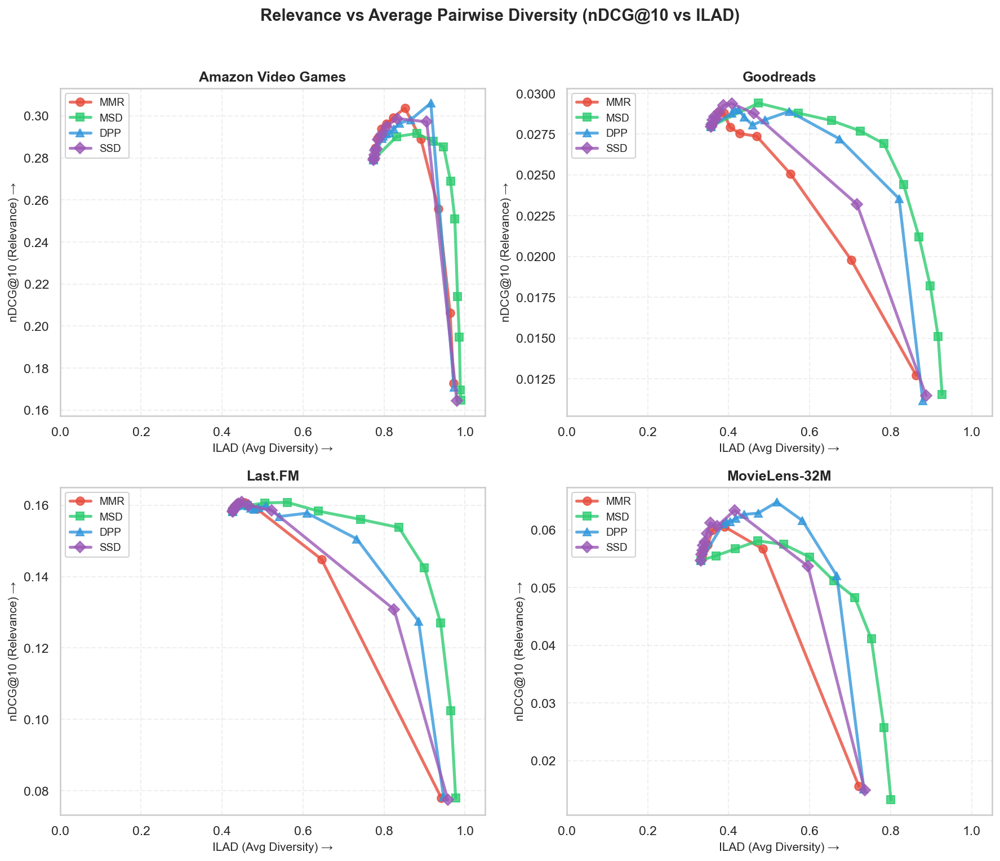
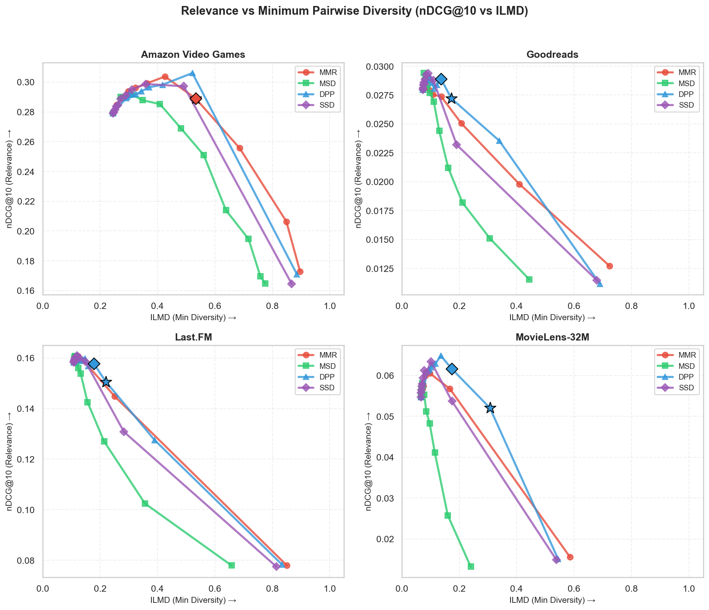
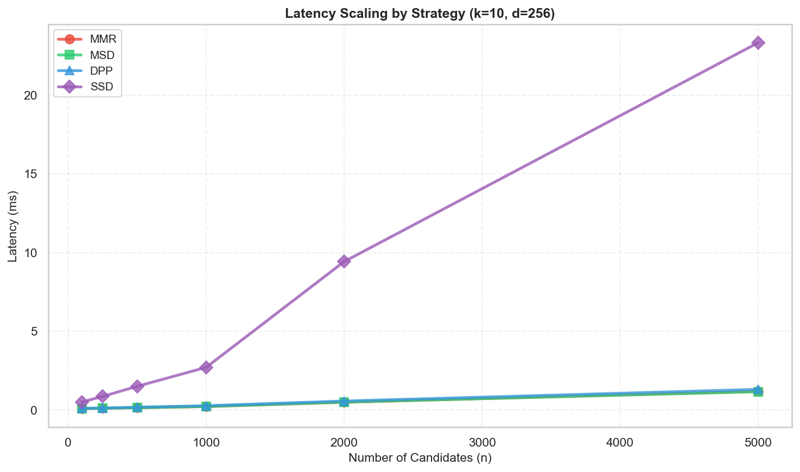

# Pyversity Benchmarks

This directory contains comprehensive benchmarks for **MMR**, **MSD**, **DPP**, and **SSD** across 4 recommendation datasets.

For each dataset, we use a leave-one-out evaluation protocol (meaning we hold out one item
per user as the test set), generate candidate items based on similar items, then rerank with each
diversification strategy. We measure relevance (nDCG) and diversity (ILAD, ILMD) to trace the
Pareto frontier of the relevance-diversity tradeoff.

In addition, we measure latency of each strategy as the number of candidates scales.

> **Note:** We don't benchmark COVER (coverage-based diversification) because it optimizes a different
> objective (topic/category coverage) and requires explicit item taxonomies not available in standard
> collaborative filtering datasets.

## Table of Contents
- [Key Findings](#key-findings)
- [Relevance-Diversity Tradeoff](#relevance-diversity-tradeoff)
- [Latency](#latency)
- [Detailed Results](#detailed-results)
- [Usage](#usage)
- [Datasets](#datasets)
- [Methodology](#methodology)
- [Citations](#citations)

## Key Findings

We measure two diversity metrics: **ILAD** (average pairwise diversity—higher = more variety) and **ILMD** (minimum pairwise diversity—higher = fewer similar pairs).

### Key Insight: Diversification Can *Improve* Relevance

A surprising finding: moderate diversification often **improves** relevance (nDCG), not just diversity. This happens because diversifiers act as intelligent tie-breakers, helping surface items from different preference modes.

### Overall Results

Each strategy's **sweet spot**—the best operating point that maintains or improves relevance:

| Strategy | `diversity` | nDCG Δ | ILAD (+%) | ILMD (+%) |
|----------|:-----------:|:------:|:---------:|:---------:|
| **DPP**  | 0.8 | **+3.9%** | +47% | **+101%** |
| SSD      | 0.8 | +3.1% | +34% | +60% |
| MMR      | 0.7 | +2.1% | +20% | +51% |
| MSD      | 0.3 | +1.2% | +33% | +18% |

*nDCG Δ and ILAD/ILMD show % change vs baseline (`diversity=0`). Sweet spot = highest diversity while improving or maintaining relevance. Results averaged across 4 datasets, 10 runs.*

**DPP leads overall**, achieving +3.9% nDCG improvement while also boosting ILAD by 47% and ILMD by 101%—a true "free lunch."

<details>
<summary>Results at Specific Relevance Floors</summary>

These tables show results when you allow some relevance loss (vs the sweet spot above which requires no loss):

#### 99% Relevance Floor (≤1% loss allowed)

| Strategy | `diversity` | nDCG Δ | ILAD | ILMD |
|----------|:-----------:|:------:|:----:|:----:|
| **DPP**  | 0.8 | **+3.7%** | 0.60 (+51%) | **0.25 (+107%)** |
| SSD      | 0.8 | +3.1% | 0.55 (+34%) | 0.21 (+60%) |
| MMR      | 0.7 | +1.8% | 0.53 (+26%) | 0.22 (+61%) |
| MSD      | 0.3 | +0.8% | 0.57 (+39%) | 0.16 (+20%) |

#### 95% Relevance Floor (≤5% loss allowed)

| Strategy | `diversity` | nDCG Δ | ILAD | ILMD |
|----------|:-----------:|:------:|:----:|:----:|
| **DPP**  | 0.8 | **+2.8%** | 0.63 (+58%) | **0.26 (+117%)** |
| MMR      | 0.8 | -2.4% | 0.61 (+53%) | 0.27 (+122%) |
| SSD      | 0.9 | +0.4% | 0.60 (+52%) | 0.23 (+88%) |
| MSD      | 0.5 | -1.6% | 0.63 (+57%) | 0.18 (+32%) |

*With a looser floor, you can push diversity higher—but DPP still leads with positive nDCG gains.*

</details>

### Recommendations

| Goal | Strategy | `diversity` | Notes |
|------|----------|:-----------:|-------|
| **Best overall** | **DPP** | 0.7-0.8 | Best combined score; improves relevance AND diversity |
| **Maximum variety (ILAD)** | **MSD** | 0.4-0.5 | Best ILAD, but worse ILMD and may lose relevance |
| **Minimize similar pairs (ILMD)** | **DPP** | 0.7-0.8 | Best ILMD with strong ILAD too |
| **Sequence-aware feeds** | **SSD** | 0.8-0.9 | Use with `recent_embeddings` |
| **Simple implementation** | **MMR** | 0.7-0.8 | Easiest to implement, good results |

*`diversity=0` prioritizes relevance, `diversity=1` prioritizes diversity.*

> **Note on SSD:** These benchmarks evaluate single-batch diversification. SSD is designed for
> **sequence-aware** diversification with `recent_embeddings`—it rewards novelty relative to
> recently shown items. In content feeds with sliding windows, SSD's novelty-relative-to-recent
> approach should yield larger effective diversity gains than shown here.

## Relevance-Diversity Tradeoff

### ILAD (Average Diversity)



*Higher ILAD = more overall variety in recommendations. ★ = best operating point at 95% floor, ◆ = best at 99% floor.*

### ILMD (Minimum Diversity)



*Higher ILMD = better worst-case diversity (fewer similar pairs). ★ = best operating point at 95% floor, ◆ = best at 99% floor.*

## Latency

All strategies are extremely fast in practice—even with 10,000 candidates, all complete in <100ms. The plot below shows latency scaling with the number of candidates (k=10, d=256):



**Key observations:**
- **All strategies are very fast**: Even with 10,000 candidates, all strategies complete in under 100ms
- **Typical use case**: With 100 candidates (common for reranking), all strategies complete in <1ms
- **MMR/MSD/DPP** are nearly identical in speed for practical candidate sizes
- **SSD** is slower due to Gram-Schmidt orthogonalization—scales with embedding dimension d

| Strategy | 100 candidates | 1,000 candidates | 10,000 candidates |
|----------|----------------|------------------|-------------------|
| MMR | ~0.1ms | ~1ms | ~10ms |
| MSD | ~0.1ms | ~1ms | ~10ms |
| DPP | ~0.1ms | ~2ms | ~20ms |
| SSD | ~0.5ms | ~5ms | ~80ms |

*Measured with k=10 items selected, d=256 dimensional embeddings.*

## Usage

```bash
# Download datasets
python -m benchmarks download

# Run benchmarks
python -m benchmarks run

# Generate report
python -m benchmarks report
```

## Detailed Results

<details>
<summary>Per-Dataset Best Configs (99% Relevance Floor)</summary>

| Dataset | Max ILAD | Max ILMD | Best Combined |
|---------|:--------:|:--------:|:------------:|
| MovieLens-32M | DPP (`diversity`=0.8) | DPP (`diversity`=0.8) | DPP (`diversity`=0.8) |
| Last.FM | DPP (`diversity`=0.7) | DPP (`diversity`=0.7) | DPP (`diversity`=0.7) |
| Amazon-VG | MSD (`diversity`=0.4) | MMR (`diversity`=0.7) | MMR (`diversity`=0.7) |
| Goodreads | MSD (`diversity`=0.4) | DPP (`diversity`=0.7) | DPP (`diversity`=0.7) |

</details>

<details>
<summary>Per-Dataset Best Configs (95% Relevance Floor)</summary>

| Dataset | Max ILAD | Max ILMD | Best Combined |
|---------|:--------:|:--------:|:------------:|
| MovieLens-32M | DPP (`diversity`=0.9) | DPP (`diversity`=0.9) | DPP (`diversity`=0.9) |
| Last.FM | MSD (`diversity`=0.6) | DPP (`diversity`=0.8) | DPP (`diversity`=0.8) |
| Amazon-VG | MSD (`diversity`=0.5) | MMR (`diversity`=0.7) | MSD (`diversity`=0.5) |
| Goodreads | MSD (`diversity`=0.5) | DPP (`diversity`=0.8) | DPP (`diversity`=0.8) |

</details>

<details>
<summary>Per-Strategy Diversity Sweep (Averaged Across Datasets)</summary>

Shows how each strategy's metrics change as you increase `diversity`, averaged across all 4 datasets.

> **Note:** nDCG Retention can exceed 100% and may not decrease monotonically. This happens because
> diversification can sometimes *improve* relevance by breaking ties among similar items or surfacing
> items that better match the held-out test item. This effect is dataset-dependent and typically
> occurs at moderate diversity levels before eventually declining at high diversity.

#### MMR

| `diversity` | nDCG Retention | ILAD | ILMD |
|:-----------:|:--------------:|:----:|:----:|
| 0.0         | 100.0%          | 0.42 (+0%) | 0.12 (+0%) |
| 0.1         | 100.6%          | 0.42 (+1%) | 0.13 (+2%) |
| 0.2         | 101.0%          | 0.43 (+3%) | 0.13 (+5%) |
| 0.3         | 101.5%          | 0.44 (+4%) | 0.14 (+9%) |
| 0.4         | 101.7%          | 0.45 (+7%) | 0.15 (+15%) |
| 0.5         | 102.0%          | 0.46 (+10%) | 0.16 (+23%) |
| 0.6         | 102.2%          | 0.48 (+16%) | 0.18 (+36%) |
| 0.7         | 100.7%          | 0.52 (+25%) | 0.22 (+61%) |
| 0.8         | 95.5%          | 0.58 (+41%) | 0.28 (+111%) |
| 0.9         | 82.4%          | 0.71 (+79%) | 0.42 (+247%) |
| 1.0         | 48.0%          | 0.92 (+142%) | 0.76 (+656%) |

#### MSD

| `diversity` | nDCG Retention | ILAD | ILMD |
|:-----------:|:--------------:|:----:|:----:|
| 0.0         | 100.0%          | 0.42 (+0%) | 0.12 (+0%) |
| 0.1         | 101.5%          | 0.46 (+11%) | 0.13 (+4%) |
| 0.2         | 101.6%          | 0.50 (+22%) | 0.14 (+11%) |
| 0.3         | 100.9%          | 0.55 (+34%) | 0.16 (+19%) |
| 0.4         | 98.6%          | 0.60 (+48%) | 0.17 (+30%) |
| 0.5         | 94.9%          | 0.66 (+64%) | 0.20 (+45%) |
| 0.6         | 89.4%          | 0.72 (+84%) | 0.23 (+65%) |
| 0.7         | 81.3%          | 0.80 (+107%) | 0.26 (+92%) |
| 0.8         | 71.4%          | 0.87 (+129%) | 0.31 (+137%) |
| 0.9         | 57.7%          | 0.93 (+145%) | 0.40 (+225%) |
| 1.0         | 45.4%          | 0.95 (+152%) | 0.53 (+374%) |

#### DPP

| `diversity` | nDCG Retention | ILAD | ILMD |
|:-----------:|:--------------:|:----:|:----:|
| 0.0         | 100.0%          | 0.42 (+0%) | 0.12 (+0%) |
| 0.1         | 102.6%          | 0.47 (+13%) | 0.15 (+26%) |
| 0.2         | 103.0%          | 0.47 (+15%) | 0.15 (+29%) |
| 0.3         | 103.3%          | 0.48 (+17%) | 0.16 (+33%) |
| 0.4         | 103.6%          | 0.49 (+19%) | 0.16 (+38%) |
| 0.5         | 103.7%          | 0.50 (+23%) | 0.17 (+46%) |
| 0.6         | 103.9%          | 0.52 (+30%) | 0.18 (+57%) |
| 0.7         | 104.2%          | 0.56 (+41%) | 0.21 (+77%) |
| 0.8         | 101.6%          | 0.64 (+65%) | 0.25 (+118%) |
| 0.9         | 88.1%          | 0.80 (+111%) | 0.39 (+275%) |
| 1.0         | 47.3%          | 0.92 (+144%) | 0.74 (+624%) |

#### SSD

| `diversity` | nDCG Retention | ILAD | ILMD |
|:-----------:|:--------------:|:----:|:----:|
| 0.0         | 100.0%          | 0.42 (+0%) | 0.12 (+0%) |
| 0.1         | 100.3%          | 0.42 (+1%) | 0.12 (+1%) |
| 0.2         | 100.7%          | 0.43 (+2%) | 0.13 (+2%) |
| 0.3         | 101.2%          | 0.43 (+3%) | 0.13 (+4%) |
| 0.4         | 101.6%          | 0.44 (+4%) | 0.13 (+6%) |
| 0.5         | 102.3%          | 0.44 (+6%) | 0.14 (+10%) |
| 0.6         | 103.1%          | 0.46 (+10%) | 0.14 (+16%) |
| 0.7         | 103.9%          | 0.48 (+16%) | 0.15 (+25%) |
| 0.8         | 103.9%          | 0.53 (+31%) | 0.18 (+47%) |
| 0.9         | 90.7%          | 0.76 (+97%) | 0.29 (+147%) |
| 1.0         | 46.5%          | 0.94 (+148%) | 0.72 (+612%) |

*Percentages show gain vs baseline (diversity=0).*

</details>


## Datasets

| Dataset | Domain | Interactions | Source |
|---------|--------|--------------|--------|
| MovieLens-32M | Movies | 32M ratings | [GroupLens](https://grouplens.org/datasets/movielens/32m/) |
| Last.FM | Music | 92K plays | [HetRec 2011](http://ir.ii.uam.es/hetrec2011/) |
| Amazon Video Games | Games | 47K reviews | [UCSD](https://cseweb.ucsd.edu/~jmcauley/datasets.html) |
| Goodreads | Books | 869K ratings | [UCSD](https://sites.google.com/eng.ucsd.edu/ucsdbookgraph/) |

## Methodology

### Experimental Setup

- **Evaluation**: Leave-one-out protocol with up to 2,000 sampled users per dataset (all users if fewer)
- **Runs**: 10 runs per dataset with different random seeds for robust results (20,000 total evaluations)
- **Embeddings**: 64-dim SVD on item co-occurrence matrix
- **Candidates**: Top-100 similar items per profile item
- **Selection**: k=10 items selected by each strategy
- **`diversity` sweep**: 0.0, 0.1, 0.2, ..., 0.9, 1.0

### Relevance-Budgeted Evaluation

We use a **relevance floor** approach to ensure fair comparison:

1. **Baseline**: For each dataset, compute baseline nDCG at `diversity=0` (no diversification)
2. **Filter**: Keep only configs where nDCG meets the relevance floor
3. **Compare**: Among feasible configs, find which strategy achieves:
   - **Max ILAD**: Best overall diversity spread
   - **Max ILMD**: Best worst-case diversity (fewer similar pairs)
   - **Best Overall**: Best 3-way score combining all metrics

We report results at two relevance floors:
- **99%**: Near-zero relevance loss, production-safe
- **95%**: Balanced tradeoff with more diversity headroom

The **3-way Score** rewards strategies that improve *all three* metrics:
- `nDCG_gain = normalized(nDCG / baseline_nDCG)`
- `ILAD_gain = (ILAD - ILAD_baseline) / (ILAD_max - ILAD_baseline)`
- `ILMD_gain = (ILMD - ILMD_baseline) / (ILMD_max - ILMD_baseline)`
- `Score = ∛(nDCG_gain × ILAD_gain × ILMD_gain)` (geometric mean)

This ensures a strategy must improve relevance AND diversity to score well.

### Diversity Metrics

| Metric | Type | Description |
|--------|------|-------------|
| **ILAD** | Average | Mean pairwise distance—measures overall variety |
| **ILMD** | Minimum | Min pairwise distance—higher = fewer similar pairs |

Both are computed as `1 - cosine_similarity` between item embeddings.

<details>
<summary>Programmatic API</summary>

```python
from benchmarks import BenchmarkConfig, run_benchmark
from pyversity import Strategy

config = BenchmarkConfig(
    dataset_path="local/data/ml-32m",
    sample_users=1000,
    strategies=[Strategy.MMR, Strategy.DPP, Strategy.MSD, Strategy.SSD],
    diversity_values=[0.0, 0.3, 0.5, 0.7, 1.0],
)
results = run_benchmark(config)
```

</details>

## Citations

```bibtex
@article{harper2015movielens,
  title={The MovieLens Datasets: History and Context},
  author={Harper, F Maxwell and Konstan, Joseph A},
  journal={ACM TiiS}, year={2015}
}

@inproceedings{cantador2011hetrec,
  title={2nd Workshop on Information Heterogeneity and Fusion in Recommender Systems},
  author={Cantador, Iv{\'a}n and Brusilovsky, Peter and Kuflik, Tsvi},
  booktitle={RecSys}, year={2011}
}

@inproceedings{ni2019amazon,
  title={Justifying Recommendations using Distantly-Labeled Reviews and Fine-Grained Aspects},
  author={Ni, Jianmo and Li, Jiacheng and McAuley, Julian},
  booktitle={EMNLP}, year={2019}
}

@inproceedings{wan2018goodreads,
  title={Item Recommendation on Monotonic Behavior Chains},
  author={Wan, Mengting and McAuley, Julian},
  booktitle={RecSys}, year={2018}
}
```
